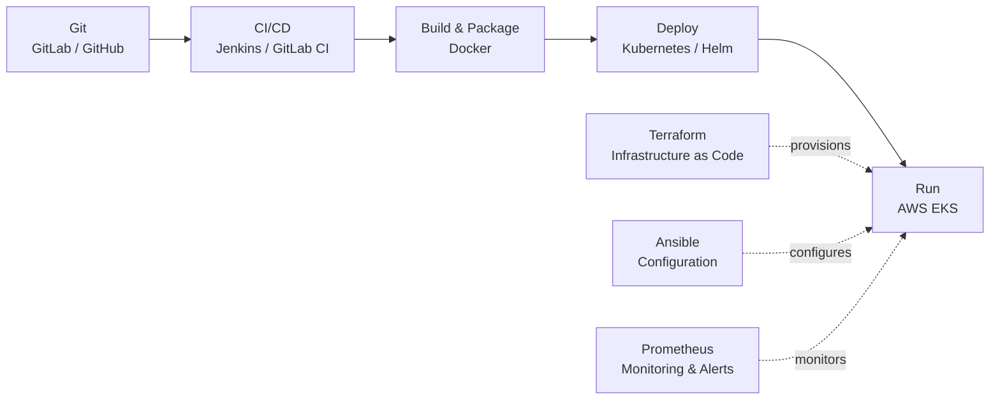

<h1 align="center">Mariam Koné</h1>
<h3 align="center">DevOps / Cloud Engineer</h3>

  

  
  
  

  
  
  

---

## 👩‍💻 About me

I'm a ** DevOps / Cloud Engineer** with a software engineering background. I design, automate and operate cloud infrastructure, with hands-on experience in **AWS, Kubernetes (EKS), Terraform, Docker, Jenkins and Ansible**.

- **Education:** Engineering degree in Computer Science (ENSA Kénitra, Morocco) and Master's degree in Information Systems Development (Université de Bretagne Occidentale, France)
- **Experience:** Internship at **Orange** on a Java / Spring Boot back-end project
- **Certifications:** HashiCorp Terraform Associate · Kubernetes and Cloud Native Associate (KCNA) · Certified DevOps Practitioner
- **Community:** Ambassador at 10000 Codeurs Mali
- **Looking for:** a junior **DevOps, Cloud, DevSecOps, SRE or Infrastructure** position (CDI) in France
- **Languages:** French · English · Bambara

---

## 🛠️ Technical skills

| Domain | Technologies |
|--------|--------------|
| **Cloud** |      |
| **Infrastructure as Code** |  |
| **Containers & Orchestration** |    |
| **CI/CD** |   |
| **Configuration Management** |  |
| **Monitoring** |  |
| **Systems** |    |
| **Programming** |     |

---

## 🔄 DevOps workflow

---

## 🚀 Featured projects

Selection of hands-on projects. The full list of 50+ projects is available on [GitLab](https://gitlab.com/devops-project5300421/myproject).

### Cloud & Infrastructure as Code

<table>
<tr>
<td width="50%" valign="top">

**Terraform – Amazon EKS** 
Provisioned a complete Amazon EKS cluster and its networking with Terraform. 
**Technologies:** AWS · EKS · Terraform 
[View project →](https://gitlab.com/devops-project5300421/myproject/terraform-eks)

</td>
<td width="50%" valign="top">

**Terraform in a CI/CD Pipeline** 
Integrated Terraform provisioning into a CI/CD pipeline, with state stored in a remote backend. 
**Technologies:** Terraform · AWS · Jenkins 
[View project →](https://gitlab.com/devops-project5300421/myproject/terraform-ci-cd)

</td>
</tr>
</table>

### CI/CD & Containers

<table>
<tr>
<td width="50%" valign="top">

**Jenkins Pipeline → AWS EC2 with Docker Compose** 
CI/CD pipeline that builds a Docker image and deploys a multi-container application to EC2. 
**Technologies:** Jenkins · Docker · Docker Compose · AWS EC2 
[View project →](https://gitlab.com/devops-project5300421/myproject/deploy-app-from-jenkins-pipeline-to-ec2/-/tree/feature/docker-compose?ref_type=heads)

</td>
<td width="50%" valign="top">

**Jenkins Shared Library** 
Reusable pipeline logic shared across projects with a Jenkins shared library. 
**Technologies:** Jenkins · Groovy · Git 
[View project →](https://gitlab.com/devops-project5300421/myproject/jenkis-shared-library)

</td>
</tr>
<tr>
<td width="50%" valign="top">

**Automatic Versioning in Jenkins** 
Pipeline that dynamically increments the application version at each build. 
**Technologies:** Jenkins · Git · CI/CD 
[View project →](https://gitlab.com/devops-project5300421/myproject/jenkis-versionning)

</td>
<td width="50%" valign="top">

</td>
</tr>
</table>

### Kubernetes & Amazon EKS

<table>
<tr>
<td width="50%" valign="top">

**Microservices with Helm & Helmfile** 
Deployed a microservices application on Kubernetes using a shared Helm chart and Helmfile. 
**Technologies:** Kubernetes · Helm · Helmfile 
[View project →](https://gitlab.com/devops-project5300421/myproject/helm-chart-microservices)

</td>
<td width="50%" valign="top">

**Jenkins → Amazon EKS** 
Continuous deployment from a Jenkins pipeline to an Amazon EKS cluster. 
**Technologies:** Jenkins · Kubernetes · AWS EKS 
[View project →](https://gitlab.com/devops-project5300421/myproject/deploy-to-eks-from-jenkins)

</td>
</tr>
<tr>
<td width="50%" valign="top">

**EKS Cluster with Node Group** 
Created an Amazon EKS cluster with a managed worker node group. 
**Technologies:** AWS · EKS · Kubernetes 
[View project →](https://gitlab.com/devops-project5300421/myproject/eks-cluster-node-group)

</td>
<td width="50%" valign="top">

</td>
</tr>
</table>

### Automation

<table>
<tr>
<td width="50%" valign="top">

**Ansible Dynamic Inventory for AWS** 
Automated server configuration using a dynamic inventory of AWS EC2 instances. 
**Technologies:** Ansible · AWS EC2 
[View on GitLab →](https://gitlab.com/devops-project5300421/myproject)

</td>
<td width="50%" valign="top">

**Python – EC2 Status Checks** 
Python script that monitors the health status of EC2 instances on a schedule. 
**Technologies:** Python · Boto3 · AWS EC2 
[View project →](https://gitlab.com/devops-project5300421/myproject/ec2-status-checks)

</td>
</tr>
</table>

### Monitoring

<table>
<tr>
<td width="50%" valign="top">

**Prometheus on Kubernetes** 
Deployed a Prometheus monitoring stack in a Kubernetes cluster. 
**Technologies:** Prometheus · Kubernetes 
[View on GitLab →](https://gitlab.com/devops-project5300421/myproject)

</td>
<td width="50%" valign="top">

**Website Monitoring & Auto-Recovery** 
Python automation that monitors a website and restarts the application on failure. 
**Technologies:** Python · Linux · Docker 
[View project →](https://gitlab.com/devops-project5300421/myproject/websitemonitoring)

</td>
</tr>
</table>

---

## 🎓 Certifications

  
  
  

| Certification | Domain |
|---------------|--------|
| HashiCorp Certified: Terraform Associate | Infrastructure as Code |
| Kubernetes and Cloud Native Associate (KCNA) | Kubernetes & Cloud Native |
| Certified DevOps Practitioner | DevOps practices & CI/CD |

---

## 📊 GitHub statistics

  <picture>
    <source media="(prefers-color-scheme: dark)" srcset="https://raw.githubusercontent.com/Mariam123-Git/Mariam123-Git/output/github-contribution-grid-snake-dark.svg" />
    <source media="(prefers-color-scheme: light)" srcset="https://raw.githubusercontent.com/Mariam123-Git/Mariam123-Git/output/github-contribution-grid-snake.svg" />
    
  </picture>

  
  

  

  

  

---

## 🤝 Community

- **Ambassador** at 10000 Codeurs Mali
- **Volunteer** at Afaaq Humanitarian Club

---

  

  <i>Automating infrastructure, one pipeline at a time.</i>

